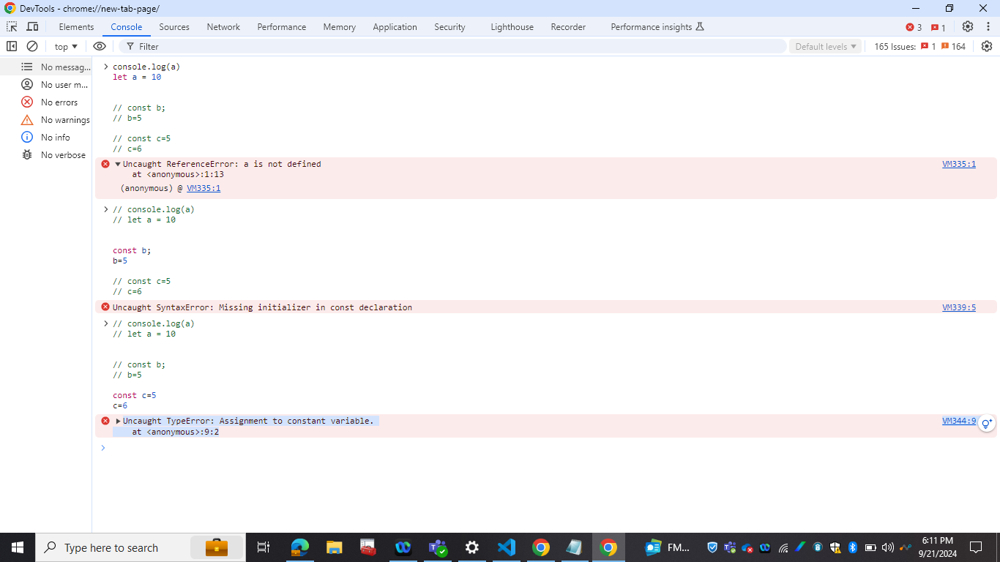

# Call, Bind, Apply
## Call
- Invokes a function with a specified this value and arguments provided individually.
- It invoken the function immediately

## apply
- Invokes a function with a specified this value and arguments provided as an array.
- It invoken the function immediately

## bind
-  Creates a new function with a specified this value and optional arguments, which can be called later.
- It don;t invokes the function immediately

```
//javascript/callbindapply.js
const data = {
    name: "John Doe",
    city: "New York",
    userInfo: function(country) {
        return `My name is ${this.name} and I live in ${this.city} From ${country}`;
    }
}

console.log(data.userInfo()); // My name is John Doe and I live in New York

//call
const data1 = {
    name: "Sara Doe",
    city: "London"
}

console.log(data.userInfo.call(data1, "UK")); // My name is Sara Doe and I live in London From UK

//apply
const data2 = {
    name: "Doe",
    city: "Paris"
}
console.log(data.userInfo.apply(data2, ["France"])); // My name is Doe and I live in Paris From France

//bind
const data3 = {
    name: "Sam",
    city: "berkley"
}
const binded = data.userInfo.bind(data3, "USA");
console.log(binded()); // My name is Sam and I live in berkley From USA

```

# Arrow Function 
- Arrow functions, introduced in ECMAScript 6 (ES6), provide a concise syntax for writing functions in JavaScript
-  They are particularly useful in simplifying code and maintaining the lexical scope of the this keyword.
- One of the most significant features of arrow functions is that they do not have their own this context. 
Instead, they inherit this from the enclosing scope.
- This is particularly useful in scenarios where you want to preserve the context of this.

```
function Person(name) {
    this.name = name;
    this.sayName = () => {
        console.log(`In start ${this.name}`);

        setTimeout(function() {
            console.log(`My name is ${this.name}`);
        }, 1000);

        setTimeout(() => {
            console.log(`My name is ${this.name}`);
        }, 1000);

        const that = this;
        setTimeout(function() {
            console.log(`My name is ${that.name}`);
        }, 1000);
    }    
}

const person = new Person("John Doe");
person.sayName(); // In start John Doe, My name is undefined, My name is John Doe
```

# Closures 
- A closure is a fundamental concept in JavaScript that allows a function to access variables from an enclosing scope, even after that scope has finished executing.
- Closures are created whenever a function is defined inside another function, allowing the inner function to "remember" the variables from the outer function's scope.

## Key Features of Closures
- **Scope Chain**: Closures have access to variables in their own scope, the scope of the outer function, and the global scope.
- **Data Privacy**: Closures can be used to create private variables and functions.
- **Stateful Functions**: Closures can maintain state between function calls.

```
function createAdder(x) {
  return function (y) {
    return x + y;
  };
}

console.log(createAdder(5)(2)); // 7
```

## Async/Await 
Syntactic sugar built on promises, providing a more synchronous-looking way to write asynchronous code.

# Undefined
- It's like placeolder kept inside variable and expalins in whole scope this variable has not assined any value
- It means memory is assined but value is not assined

# not defined 
- It means memory is not allocated to this variable or function

```
// undefined
let a;
console.log(a); // undefined
a=6
console.log(a); // 6


//not defined
console.log(b); // ReferenceError: b is not defined
console.log(someNotDefinedFunction()); // ReferenceError: someNotDefinedFunction is not defined
```

# Let & const

## Let
- The let keyword is used to declare variables that can be reassigned. It provides block scope, meaning the variable is only accessible within the block it is defined.

### Block Scope
- Variables declared with let are only accessible within the block they are defined.

### No Hoisting ( Temporal dead zone)
- Unlike var, let does hoist the variable to the top of the block but initializies that variables in specal area called Temporal dead zone.
- It's hoisted but not hoisted

### Reassignment
- Variables declared with let can be reassigned new values.

## Const 
- The const keyword is used to declare variables that are read-only after their initial assignment
- const also provides block scope.

```
var a=5
let b=5

console.lo(window.a) //5
console.lo(window.b) //undefined
```


# ReferenceError, SyntaxError, TypeError
```
console.log(a)
let a = 10

// VM335:1 Uncaught ReferenceError: a is not defined
//     at <anonymous>:1:13


const b;
b=5
// Uncaught SyntaxError: Missing initializer in const declaration


const c=5
c=6
// VM344:9 Uncaught TypeError: Assignment to constant variable.
//     at <anonymous>:9:2
```





# BLOCK SCOPE & Shadowing in JS

# Block scope
- {} know as block, also known as compound statement

```
{
    var a=1
    let b=2
    const c=3

    console.log(a) // 1
    console.log(b) // 2
    console.log(c) // 3
}

console.log(a) // 1
console.log(b) // Uncaught ReferenceError: b is not defined
```


## Shadowing
- One variable Shadow value of another
```
let b=100

{
    var a=1
    let b=2
    const c=3

    console.log(a) // 1
    //it Shadowing parent b
    console.log(b) // 2
    console.log(c) // 3
}

console.log(a) // 1
console.log(b) // 100
```

## illegal Shadowing
```
//illegal Shadowing
let a = 5
{
    var a = 5
}
//VM176:4 Uncaught SyntaxError: Identifier 'a' has already been declared
```

 

# FirstClass Function
- Ability to use function as a value, pass as argument, return as function is know as first class function

```
//Function can be passed as argument
function x(y) {
    y();
}

x(function() {
    console.log("Function passed as argument");
});
```


# this
- this value depend on how function is called
```
console.log(this); // Window

function x() {
  console.log(this); // Window
}

//this substitution
// if value of this keyword is null or undefined, 
//it will be replaced with global object in non strict mode
x() // this will be window object

//this value depend on how function is called
window.x() // this will be window object
this.x() // this will be window object

const data = {
    name: 'John',
    printName: function() {
        // this will refer to data object
        console.log(this.name);
    },
    printNameArraow: () => {
        // this will refer to window object
        console.log(this.name);
    },
    trueArrow: function() {
        //enclosing lexical scope will be in this of arrow function
        const j = () => {
            console.log(this.name);
        }
        j();
    }
}
data.printName(); // John
data.printName.call({name: 'Jane'}); // Jane
data.printNameArraow(); // undefined
data.trueArrow(); // John
```

# promice apis, allSettled, all, race,any
# async await https://www.youtube.com/watch?v=6nv3qy3oNkc&list=PLlasXeu85E9eWOpw9jxHOQyGMRiBZ60aX&index=6
# promise cainin https://www.youtube.com/watch?v=U74BJcr8NeQ&list=PLlasXeu85E9eWOpw9jxHOQyGMRiBZ60aX&index=4

# map, filter & reduce
### reduce
```
const arr = [1, 2, 3, 4, 5];

const reduce = arr.reduce((acc, curr) => {
    return acc + curr;
},0)

console.log(reduce); // 15
```

# slice vs splice
## slice
- Creates a shallow copy of a portion of an array without modifying the original array.
## Splice
- Modifies the original array by removing, replacing, or adding elements and returns the deleted elements.
```
const c = [0,1,2,3,4]
const slice = c.slice(0,3)
console.log(slice,c)// [0,1,2] ,[0,1,2,3,4] 
const splice = c.splice(0,3)
console.log(splice, c)// [0,1,2], 3,4
```

# Datatypes in javascript
## Primitive Data Types:
Number, String, Boolean, Undefined, Null, Symbol, BigInt.
## Object Data Types: 
Object, Array, Function, Date, RegExp, Map, Set.

# Rest parameter and spread operator
## Rest Parameter 
```
function functionName(a,...restParameter) {
    console.log(a, restParameter) // welcome [1,2,3]
}
functionName("Welcome", 1, 2, 3)
```
## spread operator
```
const arr1 = [1, 2, 3];
const arr2 = [4, 5, 6];
const combinedArray = [...arr1, ...arr2];

const obj1 = { a: 1, b: 2 };
const obj2 = { c: 3, d: 4 };
const combinedObject = { ...obj1, ...obj2 };
console.log(combinedObject); // Output: { a: 1, b: 2, c: 3, d: 4 }
```

# High-Order Functions
- High-order functions can take other functions as arguments. Common examples include array methods like map, filter, and reduce.

# Pure and Impure Function
## Pure
- A pure function always produces the same output for the same set of inputs.
- A pure function does not modify any external state or variables. It only depends on its input parameters and does not affect the outside world.

```
// Pure function: always returns the same output for the same inputs and has no side effects
function add(a, b) {
  return a + b;
}

console.log(add(2, 3)); // Output: 5
console.log(add(2, 3)); // Output: 5
```
## Impure Function
```
let counter = 0;

// Impure function: modifies external state (counter)
function increment() {
  counter += 1;
  return counter;
}

console.log(increment()); // Output: 1
console.log(increment()); // Output: 2
```


# What are object prototypes
# observer
# generator function
# hoistin


